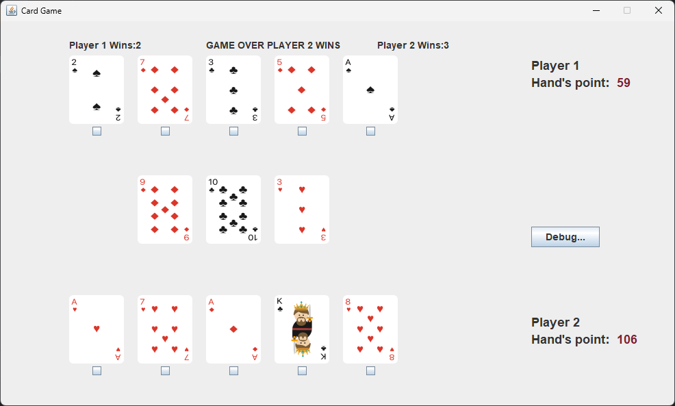

# Card Game

## Overview
This is a two-player interactive card game where players receive random cards, exchange them strategically, and compete for the highest score based on specific hand calculations.

## Gameplay
1. Each player is dealt **5 random cards**.
2. **3 community cards** are placed face down on the desk.
3. **Player 1** may choose to replace any of their cards.
4. **Player 2** may choose to replace any of their cards.
5. The **desk's 3 cards are revealed** and added to both players' hands.
6. Scores are recalculated based on hand combinations.

## Scoring Rules
- **Pair (2 same cards)** → Points **doubled**
- **Three of a Kind** → Points **tripled**
- **Four of a Kind** → Points **multiplied by 4**
- **Straight (5+ consecutive cards)** → Points **multiplied by the length of the straight**
- **Flush (6+ same suit cards)** → Points **multiplied by the number of suited cards**

## Objective
Players aim to maximize their score by making the best strategic card swaps and leveraging the desk’s revealed cards.

Enjoy the game!

